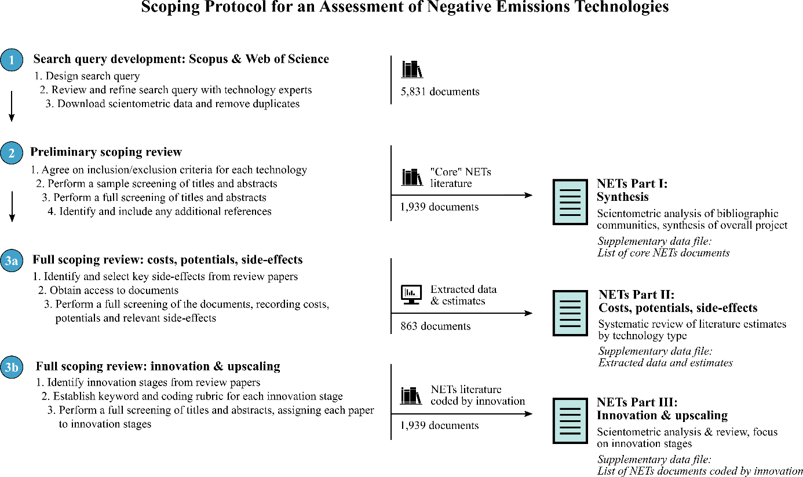

## Review Procedure

The project shared a common review methodology,
which aims to be comprehensive in terms of literature reviewed,
and transparent in the selection process.
The steps taken were as follows (also shown in the next figure):

- We developed an initial search query to identify the NETs literature,
disaggregated by each technology. Our queries are available
[here](https://github.com/mcc-apsis/NETs-review/blob/master/tables/all_queries.xlsx), and the full list of documents thereby obtained can be found [here](https://github.com/mcc-apsis/NETs-review/blob/master/tables/all_considered_docs.xlsx).

- We performed a preliminary scoping review to narrow down the search results to relevant publications by reading all the abstracts. Documents which were found to be relevant have a 1 in the `relevant` column in the spreadsheet above

- We extracted data from the relevant documents on costs, potentials and side-effects. This step is explained in detail below: documents
which were included in the spreadsheet have a 1 in the
`In_Spreadsheet` column in the spreadsheet above




## Stage 3: Collecting Costs and Potentials

The data was collected in the spreadsheet available [here](https://docs.google.com/spreadsheets/d/1iefbp2QvlLG0vDXLTKAelvdPTPVF6HECHCx7OoQa0yU/edit?usp=sharing).

The code used to sort, filter and standardise this data, and to turn it into the figures below is made available [here](https://github.com/mcc-apsis/NETs-review/tree/master/heatbars)

Note - Some users have reported problems viewing the graphs in Firefox. If you experience any issues, please try and view this page in Chrome or Internet Explorer.

### Costs


```{r plotly, warning=F, echo=F, message=F}

library(plotly)


load("plots/heatbars/costs/pl.RData")

p

```


### Potentials

```{r plotly_pots, warning=F, echo=F, message=F}

library(plotly)

load("plots/heatbars/potentials/pl.RData")

p

```

